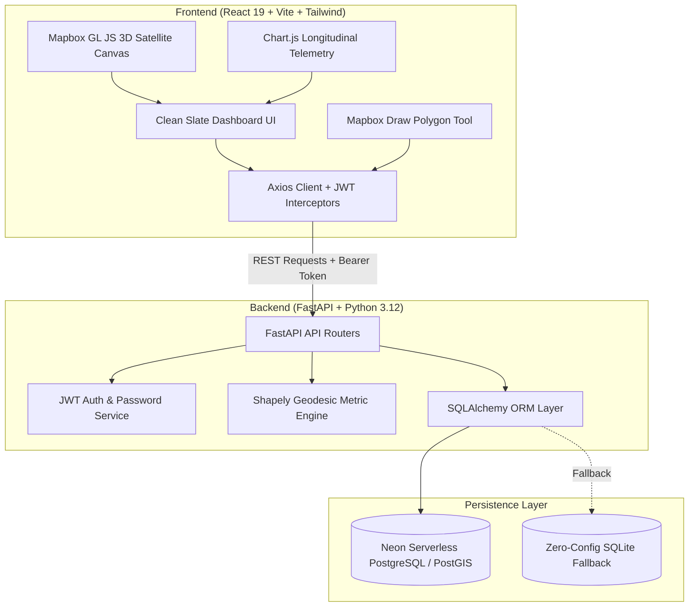

<div align="center">

# 🌿 EcoAtlas
### Next-Generation Geospatial Intelligence Platform for Carbon Sequestration & Biodiversity Monitoring

[](https://fastapi.tiangolo.com)
[](https://react.dev)
[](https://vitejs.dev)
[](https://tailwindcss.com)
[](https://www.mapbox.com)
[](https://www.postgresql.org)
[](https://neon.tech)
[](https://render.com)
[](https://vercel.com)

<p align="center">
  <b>Empowering conservationists, carbon registries, and ecological researchers with high-resolution satellite intelligence, polygon boundary drawing, geodesic area computation, and multi-sensor time-series environmental analytics.</b>
</p>

</div>

---

## 📖 Table of Contents
- [Overview](#-overview)
- [Key Features](#-key-features)
- [System Architecture](#-system-architecture)
- [Database Schema & Data Models](#-database-schema--data-models)
- [Real-World Project Catalog](#-real-world-project-catalog)
- [REST API Reference](#-rest-api-reference)
- [UI/UX & Design Philosophy](#-uiux--design-philosophy)
- [Getting Started (Local Development)](#-getting-started-local-development)
- [Cloud Deployment (Vercel + Render + Neon)](#-cloud-deployment-vercel--render--neon)
- [Automated Testing](#-automated-testing)
- [License & Acknowledgements](#-license--acknowledgements)

---

## 🌍 Overview

**EcoAtlas** is a full-stack climate-tech platform designed to address the challenges of monitoring, reporting, and verifying (MRV) large-scale ecological conservation and carbon offset reserves. 

By unifying high-resolution satellite imagery, GeoJSON geospatial boundaries, spherical geodesic calculations (Shapely), and longitudinal telemetry (NDVI, carbon stocks, canopy coverage, temperature, and precipitation), EcoAtlas provides enterprise-grade environmental intelligence in a clean, modern interface.

---

## ✨ Key Features

### 🛰️ Interactive 3D Satellite Globe & Explorer
- **Vibrant Satellite Layers**: Integrated with Mapbox GL Satellite imagery and digital elevation terrain.
- **Orbital Atmosphere & Fog**: Custom atmospheric scattering and orbital lighting shaders.
- **Responsive Viewports**: Automated `ResizeObserver` engine ensuring pixel-perfect polygon rendering on all monitor ratios and mobile devices.
- **Style Switcher**: Instantly toggle between High-Res Satellite, Dark Matter, and Outdoor Topographic maps.

### 📐 In-Browser GeoJSON Polygon Drawing
- **Interactive Boundary Tooling**: Draw custom conservation site perimeters directly over satellite maps using `@mapbox/mapbox-gl-draw`.
- **Geodesic Metric Computations**: Backend calculation of geodesic area in hectares and precise centroid coordinates using the WGS-84 coordinate reference system (`EPSG:4326`).
- **GeoJSON Feature Collection Export**: Standardized geospatial export for downstream GIS pipelines (QGIS, ArcGIS, Google Earth Engine).

### 📈 Multi-Dimensional Environmental Telemetry
- **NDVI Trends**: Normalized Difference Vegetation Index tracking photosynthetic activity and canopy health.
- **Carbon Stock & Sequestration**: Longitudinal monitoring of aboveground biomass carbon accumulation (metric tonnes).
- **Biodiversity & Canopy Metrics**: Shannon-Wiener ecological biodiversity index paired with tree canopy cover percentages.
- **Microclimate Analysis**: Correlated monthly rainfall and ambient temperature fluctuation tracking.

### 🏛️ Hierarchical Portfolio Management
- **Projects & Multi-Site Organization**: Group diverse ecological concessions, reserves, and conservation parcels under parent corporate or governmental initiatives.
- **Project Classification**: Categorized support for **Carbon Sequestration (REDD+)**, **Biodiversity Protection**, and **Mixed Ecological Reserves**.

### 🔐 Zero-Friction Authentication & Security
- **JWT & Bcrypt Security**: Industry-standard cryptographic password hashing and JSON Web Token expiration handling.
- **Auto-Demo Experience**: Seamless guest demonstration fallback allowing instant exploration, polygon creation, and metric inspection without mandatory registration hurdles.

---

## 🏗️ System Architecture



---

## 🗄️ Database Schema & Data Models

| Entity | Primary Key | Attributes & Relations | Description |
| :--- | :--- | :--- | :--- |
| **`User`** | `id` (UUID) | `email`, `password_hash`, `full_name`, `created_at` | Authenticated operators and conservation managers |
| **`Project`** | `id` (UUID) | `name`, `description`, `project_type`, `status`, `user_id` (FK) | Umbrella initiative grouping multiple conservation sites |
| **`Site`** | `id` (UUID) | `name`, `project_id` (FK), `geometry` (GeoJSON), `area_hectares`, `centroid_lat`, `centroid_lng`, `region` | Monitored polygon boundary and geographical territory |
| **`AnalyticsData`** | `id` (UUID) | `site_id` (FK), `recorded_date`, `ndvi`, `carbon_stock_tonnes`, `carbon_sequestered`, `biodiversity_index`, `tree_cover_pct`, `temperature_avg`, `rainfall_mm` | Time-series ecological telemetry and sensor records |

---

## 🗺️ Real-World Project Catalog

The platform comes pre-seeded with realistic, scientifically calibrated conservation projects across four major global biomes:

1. **Amazon Basin REDD+ Verified Reserve** *(Amazonas, Brazil)*
   - *Sites*: Rio Negro Core Primary Canopy (15,200 ha), Jau Biodiversity Wilderness (22,400 ha)
   - *Focus*: Avoided deforestation, canopy density preservation, and indigenous patrol corridor verification.
2. **Sundarbans Mangrove Blue Carbon Corridor** *(West Bengal, India / Khulna, Bangladesh)*
   - *Sites*: Sajnekhali Coastal Mangrove Belt (8,900 ha)
   - *Focus*: High-density coastal blue carbon sequestration and tidal mangrove root sediment stability.
3. **Albertine Rift Afromontane Sanctuary** *(Rwanda / DR Congo)*
   - *Sites*: Nyungwe Montane Forest Corridor (11,800 ha)
   - *Focus*: Critical habitat preservation for endangered primates and high-altitude cloud forest biodiversity.
4. **Scandinavian Boreal Peatland Restoration** *(Oulu, Northern Finland)*
   - *Sites*: Taiga Sphagnum Peat Bog Basin (6,300 ha)
   - *Focus*: Peatland rewetted soil carbon containment and sub-arctic boreal resilience.

---

## 🔌 REST API Reference

All backend API routes are documented interactively via OpenAPI / Swagger UI at `/docs`.

### Authentication (`/api/auth`)
- `POST /api/auth/register` — Register a new conservation administrator.
- `POST /api/auth/login` — Authenticate and receive JWT access token.
- `GET /api/auth/me` — Retrieve profile of the current authenticated user.

### Projects (`/api/projects`)
- `GET /api/projects` — List all projects with aggregated acreage, sites, and total carbon stocks.
- `POST /api/projects` — Create a new conservation project.
- `GET /api/projects/{id}` — Fetch detailed project metrics and associated site list.
- `DELETE /api/projects/{id}` — Remove a project and cascade site telemetry.
- `GET /api/projects/summary` — Global portfolio metrics (total hectares, carbon tonnes, active sites).

### Sites & Spatial Data (`/api/sites`)
- `GET /api/sites/geojson` — Standardized GeoJSON `FeatureCollection` of all monitored boundaries.
- `POST /api/sites/project/{project_id}` — Create site with GeoJSON polygon geometry.
- `GET /api/sites/{id}` — Site details and calculated centroid coordinates.
- `GET /api/sites/{id}/analytics` — Longitudinal historical telemetry datasets.

### Analytics (`/api/analytics`)
- `GET /api/analytics/trends` — Global aggregated carbon and biodiversity trajectory.
- `POST /api/analytics/site/{site_id}` — Ingest new sensor telemetry record.

---

## 🎨 UI/UX & Design Philosophy

- **Clean Slate Palette**: Engineered with a calm, premium `#0b0f19` dark slate canvas with emerald accents (`#10b981`) and deep celestial highlights.
- **Border-Free Ergonomics**: Removed distracting dividing lines and boxy outlines in favor of subtle surface elevations, backdrop blurs, and natural spacing.
- **High-Contrast Form Controls**: Deep `#1e293b` input fields with crisp typography ensuring effortless data entry.
- **Responsive Grid**: Fluid layout transitioning smoothly between multi-card dashboards, split-screen geospatial explorers, and comprehensive metric tables.

---

## 🚀 Getting Started (Local Development)

### Prerequisites
- Python 3.10+
- Node.js 18+ and npm
- Mapbox Access Token (free at [mapbox.com](https://mapbox.com))

### 1. Clone the Repository
```bash
git clone https://github.com/12ATHARAV/EcoAtlas.git
cd EcoAtlas
```

### 2. Backend Setup
```bash
cd backend

# Create and activate virtual environment
python -m venv venv
# On Windows:
.\venv\Scripts\activate
# On macOS/Linux:
source venv/bin/activate

# Install dependencies
pip install -r requirements.txt

# Seed sample projects and admin accounts
python -m app.seed.seed_data

# Start FastAPI server
uvicorn app.main:app --reload --port 8000
```
API Documentation will be live at: [http://localhost:8000/docs](http://localhost:8000/docs)

### 3. Frontend Setup
```bash
# In a new terminal window
cd frontend

# Install packages
npm install

# Create local environment file
cp .env.example .env  # Or create .env with:
# VITE_API_URL=http://localhost:8000/api
# VITE_MAPBOX_TOKEN=your_mapbox_token_here

# Launch Vite development server
npm run dev
```
Open [http://localhost:5173](http://localhost:5173) in your browser.

---

## ☁️ Cloud Deployment (Vercel + Render + Neon)

### 1. Database (Neon.tech)
1. Sign up at [neon.tech](https://neon.tech) (100% free serverless PostgreSQL).
2. Create project `ecoatlas` and copy your connection string:
   ```text
   postgresql://<user>:<password>@<host>/neondb?sslmode=require
   ```

### 2. Backend (Render.com)
1. In [dashboard.render.com](https://dashboard.render.com), click **New +** → **Web Service**.
2. Connect `12ATHARAV/EcoAtlas`.
3. Set configuration:
   - **Root Directory**: `backend`
   - **Runtime**: `Python 3`
   - **Build Command**: `pip install -r requirements.txt`
   - **Start Command**: `uvicorn app.main:app --host 0.0.0.0 --port $PORT`
4. Environment Variables:
   - `DATABASE_URL`: *Your Neon PostgreSQL connection string*
   - `SECRET_KEY`: *Any secure random secret key*
   - `PROJECT_NAME`: `EcoAtlas API`
5. Click **Deploy**. Note your live Render URL (e.g. `https://ecoatlas-api.onrender.com`).

### 3. Frontend (Vercel)
1. In [vercel.com](https://vercel.com), click **Add New...** → **Project**.
2. Import `12ATHARAV/EcoAtlas`.
3. Set configuration:
   - **Framework Preset**: `Vite`
   - **Root Directory**: `frontend`
4. Environment Variables:
   - `VITE_API_URL`: `https://your-backend.onrender.com/api`
   - `VITE_MAPBOX_TOKEN`: *Your Mapbox public token*
5. Click **Deploy**. Your application is live!

---

## 🧪 Automated Testing

EcoAtlas includes an automated test suite verifying token cryptography, model integrity, route responses, and spatial area computations:

```bash
cd backend
pytest tests/
```
```text
============================== 6 passed in 0.84s ==============================
```

---

## 🔑 Default Demonstration Credentials

For instant platform evaluation, use the pre-configured credentials:
- **Email**: `admin@ecoatlas.earth`
- **Password**: `Admin123!`
*(The platform also auto-authenticates guest sessions for immediate trial)*

---

## 📄 License & Acknowledgements

Built with ❤️ for climate intelligence, biodiversity restoration, and open science. Distributed under the MIT License.


